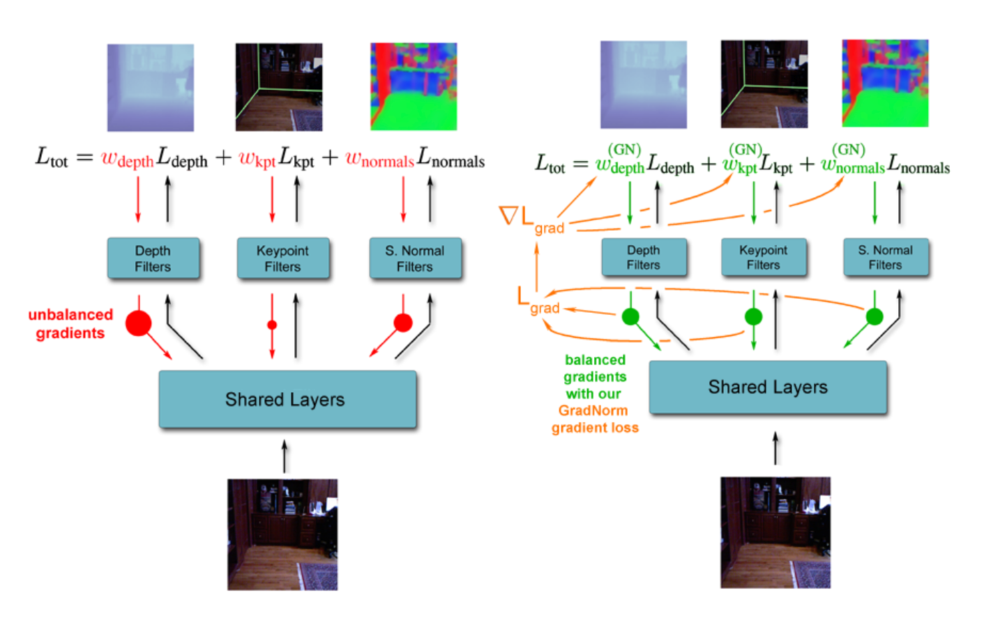

# 论文笔记

1. [GradNorm: Gradient Normalization for Adaptive Loss Balancing in Deep Multitask Networks](./Chen%20%E7%AD%89%20-%202018%20-%20GradNorm%20Gradient%20Normalization%20for%20Adaptive%20Loss.pdf)

