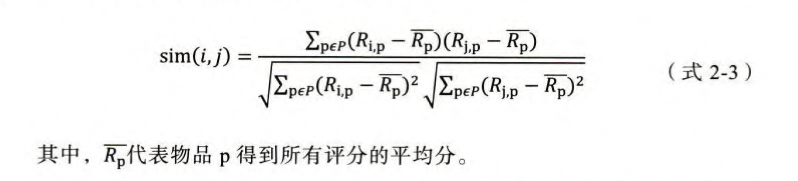

# 推荐系统总结

<!-- TOC -->

- [推荐系统总结](#推荐系统总结)
  - [传统推荐模型](#传统推荐模型)
    - [传统推荐模型的演化关系图](#传统推荐模型的演化关系图)
    - [协同过滤](#协同过滤)
      - [基于用户的协同过滤算法](#基于用户的协同过滤算法)
      - [基于物品的协同过滤](#基于物品的协同过滤)
      - [UserCF与ItemCF的应用场景](#usercf与itemcf的应用场景)
      - [协同过滤的缺陷](#协同过滤的缺陷)
    - [矩阵分解——协同过滤的进化](#矩阵分解协同过滤的进化)
      - [矩阵分解的求解方法](#矩阵分解的求解方法)
        - [消除用户和物品打分的偏差](#消除用户和物品打分的偏差)
      - [矩阵分解的优点和局限性](#矩阵分解的优点和局限性)
    - [逻辑回归——融合多种特征的推荐模型](#逻辑回归融合多种特征的推荐模型)
    - [从FM到FFM——自动特征交叉的解决方案](#从fm到ffm自动特征交叉的解决方案)
      - [POLY2模型——特征交叉的开始](#poly2模型特征交叉的开始)
      - [FM模型——隐向量特征交叉](#fm模型隐向量特征交叉)
      - [FFM模型——引入特征域的概念](#ffm模型引入特征域的概念)
    - [GBDT+LR——特征工程模型化的开端](#gbdtlr特征工程模型化的开端)
      - [GBDT进行特征转换的过程](#gbdt进行特征转换的过程)
    - [LS-PLM——大规模分段线性模型](#ls-plm大规模分段线性模型)
    - [传统推荐模型总结](#传统推荐模型总结)
  - [深度学习推荐模型](#深度学习推荐模型)
    - [Deep Crossing模型](#deep-crossing模型)

<!-- /TOC -->

## 传统推荐模型

### 传统推荐模型的演化关系图

1. **协同过滤算法族**：经典的协同过滤算法曾是推荐系统的首选模型，从物品相似度和用户相似度角度出发，协同过滤衍生出物品协同过滤（ItemCF） 和用户协同过滤（UserCF）两种算法。为了使协同过滤能够更好地处理稀疏共现矩阵问题、增强模型的泛化能力，从协同过滤衍生出矩阵分解模型（Matrix Factorization, MF），并发展出矩阵分解的各分支模型。
2. **逻辑回归模型族**：与协同过滤仅利用用户和物品之间的显式或隐式反馈信息相比，逻辑回归能够利用和融合更多用户、物品及上下文特征。从LR 模型衍生出的模型同样“枝繁叶茂”，包括增强了非线性能力的大规模分片线性模型（Large Scale Piece-wise Linear Model, LS-PLM）, 由逻辑回归发展出来的FM 模型，以及与多种不同模型配合使用后的组合模型，等等。
3. **因子分解机模型族**：因子分解机在传统逻辑回归的基础上，加入了二阶部分，使模型具备了进行特征组合的能力。更进一步，在因子分解机基础上发展出来的域感知因子分解机（Field-aware Factorization Machine, FFM）则通过加入特征域的概念，进一步加强了因子分解机特征交叉的能力。
4. **组合模型**：为了融合多个模型的优点，将不同模型组合使用是构建推荐模型常用的方法。Facebook 提出的GBDT+LR[ 梯度提升决策树(Gradient Boosting Decision Tree)+逻辑回归] 组合模型是在业界影响力较大的组合方式。此外，组合模型中体现出的特征工程模型化的思想，也成了深度学习推荐模型的引子和核心思想之一。

### 协同过滤

协同过滤算法，主要是利用用户在商品上的交互行，把用户和商品构建成共现矩阵的形式，用户作为矩阵的行坐标，商品作为列坐标，将用户在对应商品上的行为数据转换为矩阵中相应的元素值。如下图所示:

#### 基于用户的协同过滤算法

基于用户的协同过滤算法比较重要的步骤

1. **用户相似度计算**

* 余弦相似度：计算用户向量之间的余弦相似度。
$sim(i, j)=cos(i, j)=\frac{i\cdot j}{||i||\cdot||j||}$
* 皮尔逊相关系数：相比余弦相似度，皮尔逊相关系数通过使用用户平均分对各独立评分进行修正，减小了用户评分偏置的影响
$r_{xy}=\frac{\sum_{i=1}^{n}(x_i-\bar{x})(y_i-\bar{y})}{\sqrt{\sum_{i=1}^{n}(x_i-\bar{x})^2}\sqrt{\sum_{i=1}^{n}(y_i-\bar{y})^2}}$
其中，$x_1, x_2, ..., x_n$和$y_1, y_2, ..., y_n$是两个变量在$n$个样本中的取值，$\bar{x}$和$\bar{y}$分别是$x$和$y$的样本均值。$r_{xy}$的取值范围为$[-1, 1]$，表示$x$和$y$之间的线性相关程度，当$r_{xy}=1$时，表示$x$和$y$呈完全正相关；当$r_{xy}=-1$时，表示$x$和$y$呈完全负相关；当$r_{xy}=0$时，表示$x$和$y$不相关。
* 基于皮尔逊系数的思路，还可以通过引入物品平均分的方式，减少物品评分偏置对结果的影响

1. **最终结果排序**
在获得Top n相似用户之后，利用Top n用户生成最终推荐结果的过程如下。假设“目标用户与其相似用户的喜好是相似的”，可根据相似用户的已有评价对目标用户的偏好进行预测。这里最常用的方式是利用用户相似度和相似用户的评价的加权平均获得目标用户的评价预测：

1. **基于用户的协同过滤算法的缺点**
   1. 在互联网应用的场景下，用户数往往大于物品数，而UserCF需要维护用户相似度矩阵以便快速找出TOP N相似用户。该用户相似度矩阵的存储开销非常大，而且随着业务的发展，用户数的增长会导致用户相似度矩阵的空间以$n^2$的速度快速增长，这是在线存储系统难以承受的扩展速度。
   2. 用户的历史数据向量往往非常稀疏，对于只有几次购买或者点击行为的用户来说，找到相似用户的准确度非常低的，这导致UserCF不适用于那些正反馈获取较困难的的应用场景（如酒店预订，大件商品购买等低频应用）。

#### 基于物品的协同过滤

1. 基于历史数据，构建以用户（假设用户总数为m）为行坐标，物品（物品总数为n）为列坐标的 $m\times n$ 维的共现矩阵。
2. 计算共现矩阵两两列向量间的相似性（相似度计算方式与用户相似度的计算方式相同），构建 $n\times n$ 的物品相似度矩阵。
3. 获得用户历史行为数据中的正反馈物品列表。
4. 利用物品相似度矩阵，针对目标用户历史行为中的正反馈物品，找出相似的$Top K$个物品，组成相似物品集合。
5. 对相似物品集合中的物品，利用相似度分值进行排序，生成最终的推荐列表。

#### UserCF与ItemCF的应用场景

1. UserCF基于用户相似度进行推荐，使其具备更强的社交特性，用户能够快速得知与自己兴趣相似的人最近喜欢的是什么，即使某个兴趣点以前不在自己的兴趣范围内，也可以通过“朋友”的动态快速更新自己的推荐列表。这样的特点使其非常适用于新闻推荐场景。因为新闻本身的兴趣点往往是分散的，相比用户对不同新闻的兴趣偏好，新闻的及时性、热点性往往是其更重要的属性，而UserCF正适用于发现热点，以及跟踪热点的趋势。
2. ItemCF更适用于兴趣变化比较稳定的应用，比如在Amazon的电商场景中，用户在一个时间段内更倾向于寻找一类商品，这时利用物品相似度为其推荐相关物品是契合用户动机的，在Netflix的视频推荐场景中，用户观看电影、电视剧的兴趣点往往比较稳定，因此利用ItemCF推荐风格、类型相似的视频是更合理的选择。

#### 协同过滤的缺陷

1. **头部效应**
协同过滤不具备较强的泛化能力，协同过滤无法将两个物品相似这一信息推广到其他物品的相似性计算上。这就导致了一个比较严重的问题——热门的物品具有很强的头部效应，容易跟大量物品产生相似性；而尾部的物品由于特征向量稀疏，很少与其他物品产生相似性，导致很少被推荐。

为了解决上述问题，同时增加模型的泛化能力，矩阵分解技术被提出。该方法在协同过滤共现矩阵上，使用更稠密的隐向量表示用户和物品，挖掘用户和物品的隐含兴趣和隐含特征，在一定程度上弥补了协同过滤模型处理稀疏矩阵能力不足的问题。
2. **利用有效信息不充分**
协同过滤仅利用用户和物品的交互信息，无法有效地引入用户年龄、性别、商品描述、商品分类、当前时间等一系列用户特征、物品特征和上下文特征，这无疑造成了有效信息的遗漏。为了在推荐模型中引入这些特征，推荐系统逐渐发展到以逻辑回归模型为核心的、能够综合不同类型特征的机器学习模型的道路上。

### 矩阵分解——协同过滤的进化

针对协同过滤算法的头部效应较明显、泛化能力较弱的问题，矩阵分解算法被提出。矩阵分解在协同过滤算法中“共现矩阵”的基础上，计入了隐向量的概念，加强模型处理稀疏矩阵的能力，针对性地解决了协同过滤存在的主要问题。

用隐向量表达用户和物品，还要保证相似的用户及用户可能喜欢的物品的距离相近—听上去是一个非常好的想法，但关键问题是如何得到这样的隐向量呢？

#### 矩阵分解的求解方法

1. 特征值分解：只能用于方阵，不适用于分解用户-物品矩阵。
2. 奇异值分解：

3. 梯度下降

其中$p_u\in R^{k\times 1}$是用户的隐向量，$q_i\in R^{k\times 1}$是物品的隐向量。
梯度下降算法的步骤：

在完成矩阵分解过程后，即可得到所有用户和物品的隐向量。在对某用户进行推荐时，可利用该用户的隐向量与所有物品的隐向量进行逐一的内积运算，得出该用户对所有物品的评分预测，再依此进行排序，得到最终的推荐列表。
在了解了矩阵分解的原理之后，就可以更清楚地解释为什么矩阵分解相较协同过滤有更强的泛化能力。在矩阵分解算法中，由于隐向量的存在，使任意的用户和物品之间都可以得到预测分值。而隐向量的生成过程其实是对共现矩阵进行全局拟合的过程，因此隐向量其实是利用全局信息生成的，有更强的泛化能力；而对协同过滤来说，如果两个用户没有相同的历史行为，两个物品没有相同的人购买，那么这两个用户和两个物品的相似度都将为0（因为协同过滤只能利用用户和物品自己的信息进行相似度计算，这就使协同过滤不具备泛化利用全局信息的能力）。

##### 消除用户和物品打分的偏差

#### 矩阵分解的优点和局限性

相比协同过滤，矩阵分解有如下非常明显的优点

1. **泛化能力强**，在一定程度上解决了数据稀疏问题。
2. **空间复杂度低**，不需要再存储协同过滤模型服务阶段所需的“庞大”的用户相似性或物品相似性矩阵，只需存储用户和物品隐向量。空间复杂度由$n^2$级别降低到$(n+m)\cdot k$级别。
3. **更好的扩展性和灵活性**，矩阵分解的最终产出是用户和物品隐向量，这其实与深度学习中的embedding思想不谋而合，因此矩阵分解的结果也非常便于与其他特征进行组合和拼接，并便于与深度学习网络进行无缝结合。

**缺点**：矩阵分解同样不方便加入用户、物品和上下文相关的特征。

### 逻辑回归——融合多种特征的推荐模型

相比协同过滤模型仅利用用户与物品的相互行为信息进行推荐，逻辑回归模型能够综合利用用户、物品、上下文等多种不同的特征，生成较为全面的推荐结果。

**逻辑回归模型的优势：**

1. **数学含义上的支撑**
逻辑回归作为广义线性模型的一种，它的假设是因变量y 服从伯努利分布。那么在CTR 预估这个问题上，“点击” 事件是否发生就是模型的因变量而用户是否点击广告是一个经典的掷偏心硬币问题。因此，CTR 模型的因变量显然应该服从伯努利分布。所以，采用逻辑回归作为CTR 模型是符合“点击” 这一事件的物理意义的。
与之相比，线性回归作为广义线性模型的另一个特例，其假设是因变量y 服从高斯分布，这明显不是点击这类二分类问题的数学假设。
2. **可解释性强**
3. **工程化需要**
在互联网公司每天动辄TB 级别的数据面前，模型的训练开销和在线推断效率显得异常重要。在GPU 尚未流行的2012 年之前，逻辑回归模型凭借其易于并行化、模型简单、训练开销小等特点，占据着工程领域的主流。囿于工程团队的限制，即使其他复杂模型的效果有所提升，在没有明显击败逻辑回归模型之前，公司也不会贸然加大计算资源的投人，升级推荐模型或CTR 模型，这是逻辑回归持续流行的另一重要原因。

**逻辑回归模型的局限性：** 表达能力不强，无法进行特征交叉、特征筛选。

### 从FM到FFM——自动特征交叉的解决方案

#### POLY2模型——特征交叉的开始

针对特征交叉的问题，算法工程师经常采用先手动组合特征，再通过各种分析手段筛选特征的方法，但该方法无疑是低效的。更遗憾的是，人类的经验往往有局限性，程序员的时间和精力也无法支撑其找到最优的特征组合。因此，采用P0LY2 模型进行特征的“暴力” 组合成了可行的选择。

#### FM模型——隐向量特征交叉

FM模型的数学表达式如下：

$\hat{y}(x) = w_0 + \sum_{i=1}^{n} w_ix_i + \sum_{i=1}^{n}\sum_{j=i+1}^{n} \langle \mathbf{v}_i, \mathbf{v}_j \rangle x_i x_j$

FM通过引入特征隐向量的方式，直接把POLY2模型$n^2$级别的权重参数数量减少到了$n\times k$ (k为隐向量维度,$n\gg k$)。在使用梯度下降法进行FM训练的过程中，FM的训练复杂度同样可降低到$n\times k$ 级别，极大地降低了训练开销。

#### FFM模型——引入特征域的概念

FFM（Field-aware Factorization Machine）最初的概念来自Yu-Chin Juan（阮毓钦，毕业于中国台湾大学，现在美国Criteo工作）与其比赛队员，是他们借鉴了来自Michael Jahrer的论文[14]中的field概念提出了FM的升级版模型。通过引入field的概念，FFM把相同性质的特征归于同一个field。以上面的广告分类为例，“Day=26/11/15”、“Day=1/7/14”、“Day=19/2/15”这三个特征都是代表日期的，可以放到同一个field中。同理，商品的末级品类编码生成了550个特征，这550个特征都是说明商品所属的品类，因此它们也可以放到同一个field中。简单来说，同一个categorical特征经过One-Hot编码生成的数值特征都可以放到同一个field，包括用户性别、职业、品类偏好等。**在FFM中，每一维特征 xi，针对其它特征的每一种field fj，都会学习一个隐向量 vi,fj。因此，隐向量不仅与特征相关，也与field相关。** 也就是说，“Day=26/11/15”这个特征与“Country”特征和“Ad_type”特征进行关联的时候使用不同的隐向量，这与“Country”和“Ad_type”的内在差异相符，也是FFM中“field-aware”的由来。[详细介绍链接](https://tech.meituan.com/2016/03/03/deep-understanding-of-ffm-principles-and-practices.html)

$\hat{y}(x) = w_0 + \sum_{i=1}^{n} w_ix_i + \sum_{i=1}^{n}\sum_{j=i+1}^{n} \langle \mathbf{v}_{i,f_j}, \mathbf{v}_{j,f_i} \rangle x_{i} x_{j}$

其中$f_j$是第$j$个特征所属的field。如果隐向量的长度为 k，那么FFM的二次参数有 nfk个，远多于FM模型的$nk$个。此外，由于隐向量与field相关，FFM二次项并不能够化简，其预测复杂度是 $O(kn^2)$。

### GBDT+LR——特征工程模型化的开端

FM和FFM采用引入隐向量的方式增强了模型的特征交叉能力，但无论如何，这些都只能做二阶的特征交叉，如果继续提高特征交叉的维度，会不可避免地产生组合爆炸和计算复杂度过高的问题。GBDT + LR组合模型能够有效地处理高维特征组合和筛选的问题。

简而言之，利用GBDT自动进行特征筛选和组合，进而生成新的离散特征向量，再把该特征向量当做LR模型的输入，预估CTR的模型结构如下图所示：

需要强调的是，用GBDT构建特征工程，利用LR预估CTR这两步是独立训练的，所以不存在如何将LR的梯度回传到GBDT这类复杂的问题。

#### GBDT进行特征转换的过程

利用训练集训练好GBDT模型之后，就可以利用该模型完成从原始特征向量到新的离散型特征向量的转化。具体过程如下。

一个训练样本在输人GBDT的某一子树后，会根据每个节点的规则最终落人某一叶子节点，把该叶子节点置为1，其他叶子节点置为0 , 所有叶子节点组成的向量即形成了该棵树的特征向量，把GBDT 所有子树的特征向量连接起来，即形成了后续LR模型输人的离散型特征向量。

事实上，决策树的深度决定了特征交叉的阶数。如果决策树的深度为4 , 则通过3 次节点分裂，最终的叶节点实际上是进行三阶特征组合后的结果，如此强的特征组合能力显然是FM 系的模型不具备的。但GBDT 容易产生过拟合，以及GBDT 的特征转换方式实际上丢失了大量特征的数值信息，因此不能简单地说GBDT 的特征交叉能力强，效果就比FFM 好，在模型的选择和调试上，永远都是多种因素综合作用的结果。

### LS-PLM——大规模分段线性模型

LS-PLM, 又被称为MLR（Mixed Logistic Regression, 混合逻辑回归）模型。本质上，LS-PLM 可以看作对逻辑回归的自然推广，它在逻辑回归的基础上采用分而治之的思路，先对样本进行分片，再在样本分片中应用逻辑回归进行CTR预估。

在逻辑回归的基础上加人聚类的思想，其灵感来自对广告推荐领域样本特点的观察。举例来说，如果CTR 模型要预估的是女性受众点击女装广告的CTR - 那么显然，我们不希望把男性用户点击数码类产品的样本数据也考虑进来，因为这样的样本不仅与女性购买女装的广告场景毫无相关性，甚至会在模型训练过程中扰乱相关特征的权重。为了让CTR 模型对不同用户群体、不同使用场景更有针对性，其采用的方法是先对全量样本进行聚类，再对每个分类施以逻辑回归模型进行CTR预估。LS-PLM的实现思路就是由该灵感产生的。

其中的超参数“分片数” m可以较好地平衡模型的拟合与推广能力。当m=1时，LS-PLM 就退化为普通的逻辑回归。m 越大，模型的拟合能力越强。与此同时，模型参数规模也随m 的增大而线性增长，模型收敛所需的训练样本也随之增长。在实践中，阿里巴巴给出的m 的经验值为12。

本节尝试用深度学习的思路去解释LS-PLM 模型，当作对深度学习部分的一次预热。LS-PLM 可以看作一个加人了注意力Attention 机制的三层神经网络模型，其中输人层是样本的特征向量，中间层是由m 个神经元组成的隐层，其中m 是分片的个数，对于一个CTR 预估问题，LS-PLM 的最后一层自然是由单一神经元组成的输出层。

那么，注意力机制又是在哪里应用的呢？其实是在隐层和输出层之间，神经元之间的权重是由分片函数得出的注意力得分来确定的。也就是说，样本属于哪个分片的概率就是其注意力得分。

### 传统推荐模型总结

## 深度学习推荐模型

深度学习推荐模型演化图：

主要的演变方向如下：

1. **改变神经网络的复杂程度：** 从最简单的单层神经网络模型AutoRec（自编码器推荐），到经典的深度神经网络结果 Deep Crossing（深度特征交叉），其主要的进化方式在于——增加了深度神经网络的层数和结构复杂度。
2. **改变特征交叉方式：** 这类模型的主要改变在于丰富了深度学习网络中特征交叉的方式。例如，改变了用户向量和物品向量互操作方式的NeuralCF(Neural Collaborative Filtering，神经网络协同过滤)，定义了多种特征向量交叉操作的PNN（Product-based Neural NetWork，基于积操作的神经网络）模型。
3. **组合模型：** 这类模型主要是指Wide&Deep模型及其后续变种Deep&Cross、DeepFM等，其思路是通过组合两种不同特点、优势互补的深度学习网络，提升模型的综合能力。
4. **FM模型深度学习演化版本：** 传统推荐模型FM 在深度学习时代有了诸多后续版本，其中包括NFM（Neural Factorization Machine, 神经网络因子分解机）、FNN （Factorization-machine supported Neural Network, 基于因子分解机支持的神经网络）、AFM (Attention neural Factorization Machine, 注意力因子分解机）等，它们对FM 的改进方向各不相同。例如，NFM 主要使用神经网络提升FM 二阶部分的特征交叉能力，AFM 是引入了注意力机制的FM 模型，FNN利用FM 的结果进行网络初始化。
5. **注意力机制与推荐模型的结合：** 这类模型主要是将“注意力机制”应用于深度学习推荐模型中，主要包括结合了FM 与注意力机制的AFM 和引入了注意力机制的CTR 预估模型DIN （Deep Interest Network, 深度兴趣网络）。
6. **序列建模与推荐模型的结合：** 这类模型的特点是使用序列模型模拟用户行为或用户兴趣的演化趋势，代表模型是DIEN（Deep Interest Evolution Network,深度兴趣进化网络）。
7. **强化学习与推荐模型结合：** 这类模型将强化学习应用于推荐领域，强调模型的在线学习和实时更新，其代表模型是DRN （ Deep Reinforcement Learning Network, 深度强化学习网络）。

### Deep Crossing模型

