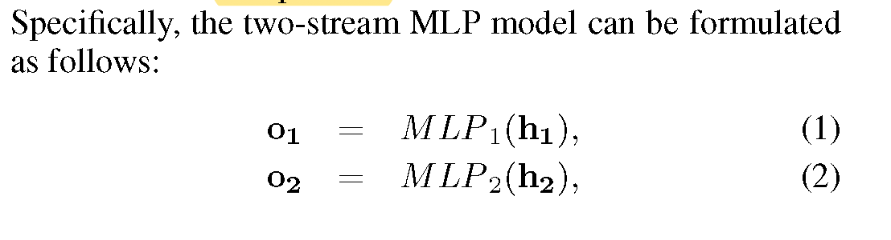
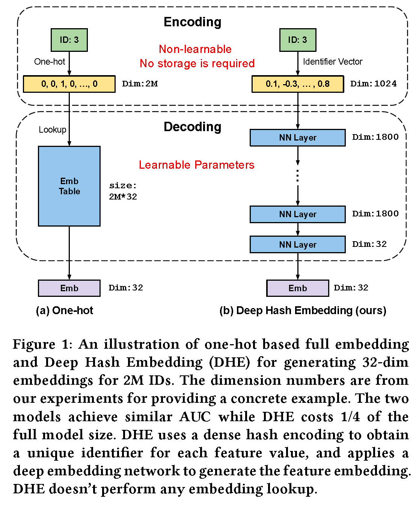

# 论文笔记

## 推荐CTR模型

1. [FinalMLP: An Enhanced Two-Stream MLP Model for CTR Prediction](./%E6%8E%A8%E8%8D%90CTR%E6%A8%A1%E5%9E%8B/FinalMLP-%20An%20Enhanced%20Two-Stream%20MLP%20Model%20for%20CTR%20Prediction.pdf)
   1. 代表性的 Two-Stream 点击率模型：
      * wide&deep
      * DeepFm
      * DCN
      * xDeepFm
      * AutoInt+
      * AFN+
      * DeepIM
      * MaskNet
      * DCN-V2
      * EDCN

   2. 特征选择模块（以两个stream为例）
   
   
   每个gate网络输入的特征可以自行选择用户/item或者其他特征
   通过添加特征选择模块可以使上层的mlp网络的输入特征有区分，能使上层的mlp网络减少同质性，能够对特征交互进行更多的补充学习。
   
   该例子展示了两路特征选择分别从用户和item两个角度来进行特征选择。
   3. stream level Interaction Aggregation（mlp 输出怎么进行交互聚合）
      1. Bilinear Fusion（双线性融合）
      双线性融合中，当d1和d2的维度比较大的时候 $W_3$的参数太大了，例如需要融合两个1000维的特征，$W_3\in R^{1000 \times 1000}$
      
      2. Multi-Head Bilinear Fusion
      将MLP的输出$O_1和O_2$分为k个子空间：
      
      最后的输出：
      
      这样处理之后对应计算复杂度从$O(d_1d_2)下降到O(\frac{d_1d_2}{k})$
      

## 多目标模型

### [Recommending What Video to Watch Next: A Multitask Ranking System](./%E5%A4%9A%E7%9B%AE%E6%A0%87/Zhao%20%E7%AD%89%20-%202019%20-%20Recommending%20what%20video%20to%20watch%20next%20a%20multitask.pdf)

主要介绍了MMOE模型结构，以及通过shallow tower解决排序上的位置偏差的问题。
解决精排排序位置偏差的方式，shallow tower的训练和推理的时候有些不同具体如下：
    1. 训练的时候，训练样本中含有位置信息以及设备信息（因为不同设备屏幕大小不一致，对应的位置偏差情况也不同），需要注意的是在训练的时候会随机选择10%的样本丢弃掉对应的位置信息，防止shallow tower过拟合位置信息。
    2. 推理的时候，位置信息会当做缺失特征。
    3. 最后应用的时候是shallow tower得到logit加上main tower的输出logit，具体的应用如图所示
    

## embedding优化

### [Learning to Embed Categorical Features without Embedding Tables for Recommendation](./embedding%E4%BC%98%E5%8C%96/Learning%20to%20Embed%20Categorical%20Features%20without%20Embedding%20Tables%20for%20Recommendation.pdf)

在大型平台的推荐网络中userID或者itemID会存在下面的问题

1. 用onehot + embedding的形式话，需要的内存会特别大
2. 也会存在很多新的userID或者itemID，传统的方式不是很好处理

本文中提出的对这些embedding的优化方式为DHE(Deep Hash Embedding):

1. 利用多个hash函数对对应feature进行编码得到对应唯一的向量编码，这个encode的过程是个唯一和确定的但是不可学习的参数，这些hash函数是均匀hash到[1, m] (这里m一般设置一个较大值例如$10^6$)
   1. 具体的hash方式可以使用[Universal Hashing全域哈希方式](./embedding%E4%BC%98%E5%8C%96/Universal%20Classes%20of%20Hash%20Functions(extended%20abstract).pdf)
      1. 全域hash的具体意思为：
      你有一组函数H包含|H|个函数，把所有的关键字散列成0～m-1的哈希值。我们把H设计成有这样一个性质：对于所有的不相等关键字x和y，使x和y的散列值相等的函数h的个数等于|H|/m那么，在不知道选择了哪个函数时，两个不相等的关键字x和y会有相同的哈希值的概率可以计算出来：在最开始时随机选一个函数hi，然后所有的值都用这个函数散列，那么P{  还没确定函数hi时，hi(x)=hi(y)且x!=y  }= 使hi(x)=hi(y)相等的函数个数 / 函数的总个数= ( |H|/m ) / |H| = 1/m正好等于随机选择散列值时，两个不同关键字散列值相等的概率
      2. 全域散列解决的是确定性散列算法无法应对特殊输入的问题。我们有 m（为方便讨论，不妨设 m 远大于 2）个格子时，单个好的散列函数的冲突概率是 1/m（已经均匀散列了，但还会恰好两个掉到同一个格子里）。但是，我们可以为这个“好的”散列函数精心构造输入数据：把正好都掉到一个格子里的数拿出来作为输入，这样冲突概率就 100% 了。我们要解决的问题是，对于精心构造的输入，冲突率仍然可以达到 1/m。
      灵感是随机地选散列函数。如果散列函数是随机选择的，那么精心构造的数据就不一定起作用了。但是，
         1. 多少个备选函数才够呢？比如，两个是不够的。比如我们有两个散列函数 h1 和 h2 来随机选择，各 50% 概率被选到。那么构造一个 h1 的特殊输入（让 h1 100% 冲突），这个输入里任意两个元素仍然会有 50% 的情况一定冲突（就是 h1 被选中的概率），没有达到理想的 1/m。
         2. 备选函数够多就可以吗？比如，这些函数都会在两个特殊的点上面冲突，即存在 x != y，使得任取 h 都有 h(x) == h(y)，那么用这两个点作为输入，冲突概率就是 100%。也就是说，这些函数冲突的地方还不能太重合。

      全域散列指出可以选择 |H| 个散列函数，且它们最大重合 ≤ |H|/m。其中重合是指，对任意 x != y，散列函数集合 H 中 h(x) == h(y) 的散列函数个数。随机选择散列函数后，对于精心构造的 x, y（我知道 x, y 会在某个或某些函数上冲突），能够被这个 x, y 命中的散列函数个数就会 ≤ |H|/m，即命中概率 ≤ |H|/m / |H| = 1/m。也就是说，对于精心构造的输入，冲突率重新达到了 1/m。

2. 然后把得到的hash编码数正则化到[-1, 1]之间
3. 然后这个的向量编码会输入到对应DNN网络中最后输出需要维度数量的向量

两种方法的对比如下：

DHE使用mish激活函数是最优的

本文讨论了什么样的embedding encode方法是好的，需要有哪些性质：

1. **唯一性**：如果encode方法产出的ID不是唯一的话，会导致下游的decode方法区分不了不同的特征。
2. **相等的相似性**：因为我们事先不知道ID特征的相似性情况，所以我们只能使任意两个ID的特征对应的编码相似性应该是相等的。
3. **高纬度**：因为我们encode后的特征希望能够被后续的decode容易区分，而高纬度空间更容易被区分。
4. **高香农熵**：这主要是为了防止冗余的维度数量
    > The Shannon entropy measures (in the unit of ‘bits’) the information carried in a dimension. The high entropy requirement is to prevent redundant dimensions from the information theory perspective. For example, an encoding scheme may satisfy the above three properties, but, on some dimensions, the encoding values are the same for all the feature values.

## 激活函数

### [Mish: A Self Regularized Non-Monotonic Neural Activation Function](./%E5%85%B6%E4%BB%96/Mish-%20A%20Self%20Regularized%20Non-Monotonic%20Neural%20Activation%20Function.pdf)

## loss优化论文

### [GradNorm: Gradient Normalization for Adaptive Loss Balancing in Deep Multitask Networks](./%E5%A4%9A%E5%9C%BA%E6%99%AF/Chen%20%E7%AD%89%20-%202018%20-%20GradNorm%20Gradient%20Normalization%20for%20Adaptive%20Loss.pdf)

## 模型微调技术

1. [知乎介绍文章](https://zhuanlan.zhihu.com/p/620618701)

2. parameter-efficient fine-tuning综述：[Scaling Down to Scale Up: A Guide to Parameter-Efficient Fine-Tuning](./%E6%A8%A1%E5%9E%8B%E5%BE%AE%E8%B0%83%E6%8A%80%E6%9C%AF/Scaling%20Down%20to%20Scale%20Up-%20A%20Guide%20to%20Parameter-Efficient%20Fine-Tuning.pdf)

3. [介绍文章](/%E6%A8%A1%E5%9E%8B%E5%BE%AE%E8%B0%83%E6%8A%80%E6%9C%AF/%E8%AE%A9%E5%A4%A9%E4%B8%8B%E6%B2%A1%E6%9C%89%E9%9A%BETuning%E7%9A%84%E5%A4%A7%E6%A8%A1%E5%9E%8B-PEFT%E6%8A%80%E6%9C%AF%E7%AE%80%E4%BB%8B.pdf)

4. [Parameter-Efficient Transfer Learning for NLP](/%E6%A8%A1%E5%9E%8B%E5%BE%AE%E8%B0%83%E6%8A%80%E6%9C%AF/Parameter-Efficient%20Transfer%20Learning%20for%20NLP.pdf)

   1. 减少fine-tuning参数，提升训练速度
   2. 连续学习的遗忘问题：adapter冻结了原有模型的参数，保证了原来的知识不被遗忘。
   3. 多任务学习：使用adapter也可以用比较少量的参数学习多个任务，和传统的多任务学习相比，好处是不同任务之间影响较少，坏处是不同任务带来的相互的监督可能会变少。

5. [Prefix-Tuning: Optimizing Continuous Prompts for Generation](./%E6%A8%A1%E5%9E%8B%E5%BE%AE%E8%B0%83%E6%8A%80%E6%9C%AF/Prefix-Tuning-%20Optimizing%20Continuous%20Prompts%20for%20Generation.pdf)

## 其他论文

### [Generative Agents: Interactive Simulacra of Human Behavior](./%E5%85%B6%E4%BB%96/Generative%20Agents-%20Interactive%20Simulacra%20of%20Human%20Behavior.pdf)

1. [人工通用智能的星星之火:GPT-4的早期实验](./%E5%85%B6%E4%BB%96/%E4%BA%BA%E5%B7%A5%E9%80%9A%E7%94%A8%E6%99%BA%E8%83%BD%E7%9A%84%E6%98%9F%E6%98%9F%E4%B9%8B%E7%81%AB-GPT-4%E7%9A%84%E6%97%A9%E6%9C%9F%E5%AE%9E%E9%AA%8C.pdf)

## 多模态模型

1. [Learning Transferable Visual Models From Natural Language Supervision](./%E5%A4%9A%E6%A8%A1%E6%80%81/Learning%20transferable%20visual%20models%20from%20natural%20language%20supervision.pdf)

## 语义检索

1. [SimCSE: Simple Contrastive Learning of Sentence Embeddings](./%E8%AF%AD%E4%B9%89%E6%A3%80%E7%B4%A2/SimCSE-%20Simple%20Contrastive%20Learning%20of%20Sentence%20Embeddings.pdf)