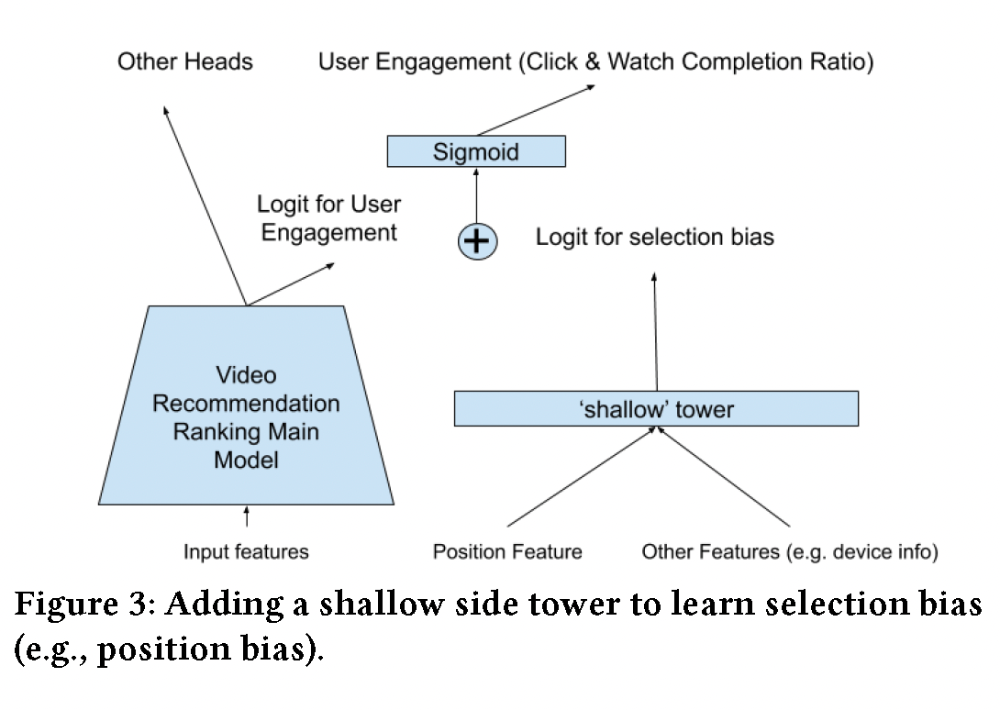
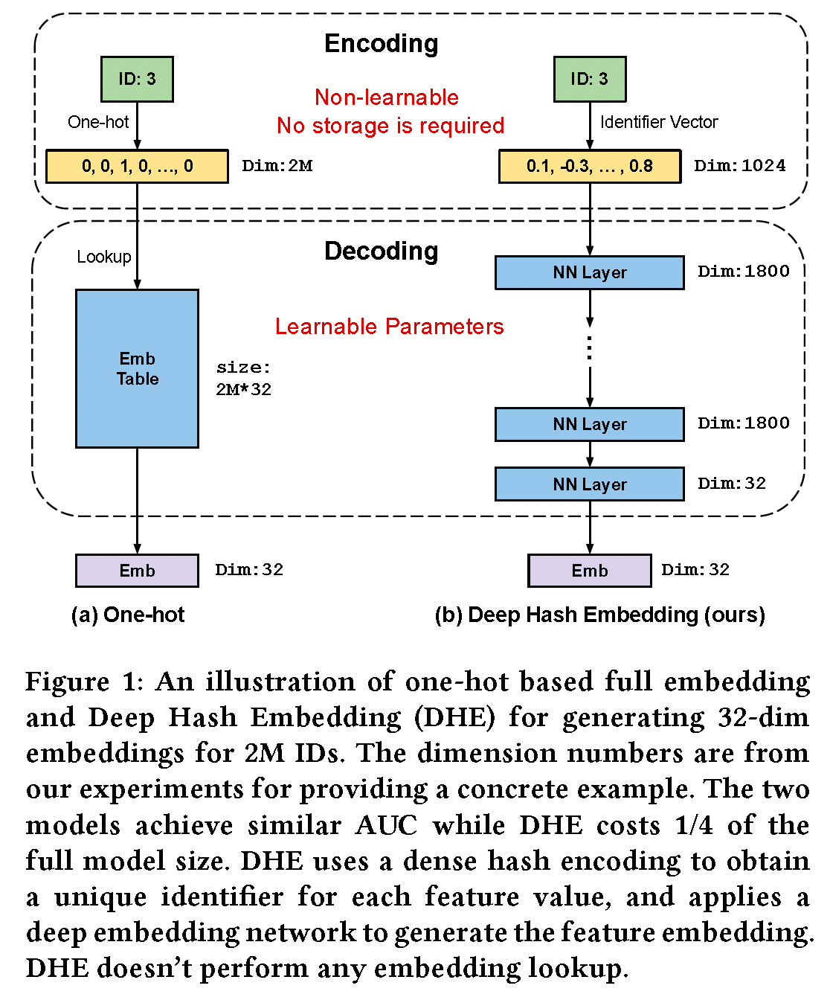

# 论文笔记

## 多目标模型

### [Recommending What Video to Watch Next: A Multitask Ranking System](./%E5%A4%9A%E7%9B%AE%E6%A0%87/Zhao%20%E7%AD%89%20-%202019%20-%20Recommending%20what%20video%20to%20watch%20next%20a%20multitask.pdf)

主要介绍了MMOE模型结构，以及通过shallow tower解决排序上的位置偏差的问题。
解决精排排序位置偏差的方式，shallow tower的训练和推理的时候有些不同具体如下：
    1. 训练的时候，训练样本中含有位置信息以及设备信息（因为不同设备屏幕大小不一致，对应的位置偏差情况也不同），需要注意的是在训练的时候会随机选择10%的样本丢弃掉对应的位置信息，防止shallow tower过拟合位置信息。
    2. 推理的时候，位置信息会当做缺失特征。
    3. 最后应用的时候是shallow tower得到logit加上main tower的输出logit，具体的应用如图所示
    

## embedding优化

### [Learning to Embed Categorical Features without Embedding Tables for Recommendation](./embedding%E4%BC%98%E5%8C%96/Learning%20to%20Embed%20Categorical%20Features%20without%20Embedding%20Tables%20for%20Recommendation.pdf)

在大型平台的推荐网络中userID或者itemID会存在下面的问题

1. 用onehot + embedding的形式话，需要的内存会特别大
2. 也会存在很多新的userID或者itemID，传统的方式不是很好处理

本文中提出的对这些embedding的优化方式为DHE(Deep Hash Embedding):

1. 利用多个hash函数对对应feature进行编码得到对应唯一的向量编码，这个encode的过程是个唯一和确定的但是不可学习的参数
2. 然后这个的向量编码会输入到对应DNN网络中最后输出需要维度数量的向量

两种方法的对比如下：

DHE使用mish激活函数是最优的

本文讨论了什么样的embedding encode方法是好的，需要有哪些性质：

1. **唯一性**：如果encode方法产出的ID不是唯一的话，会导致下游的decode方法区分不了不同的特征。
2. **相等的相似性**：因为我们事先不知道ID特征的相似性情况，所以我们只能使任意两个ID的特征对应的编码相似性应该是相等的。
3. **高纬度**：因为我们encode后的特征能够被后续decode容易区分，而高纬度空间更容易被区分。
4. **高香农熵**：这主要是为了防止冗余的维度数量
    > The Shannon entropy measures (in the unit of ‘bits’) the information carried in a dimension. The high entropy requirement is to prevent redundant dimensions from the information theory perspective. For example, an encoding scheme may satisfy the above three properties, but, on some dimensions, the encoding values are the same for all the feature values.

## 激活函数

### [Mish: A Self Regularized Non-Monotonic Neural Activation Function](./%E5%85%B6%E4%BB%96/Mish-%20A%20Self%20Regularized%20Non-Monotonic%20Neural%20Activation%20Function.pdf)

## loss优化论文

### [GradNorm: Gradient Normalization for Adaptive Loss Balancing in Deep Multitask Networks](./%E5%A4%9A%E5%9C%BA%E6%99%AF/Chen%20%E7%AD%89%20-%202018%20-%20GradNorm%20Gradient%20Normalization%20for%20Adaptive%20Loss.pdf)

## 模型微调技术

### [知乎介绍文章](https://zhuanlan.zhihu.com/p/620618701)

   1. parameter-efficient fine-tuning综述：[Scaling Down to Scale Up: A Guide to Parameter-Efficient Fine-Tuning](./%E6%A8%A1%E5%9E%8B%E5%BE%AE%E8%B0%83%E6%8A%80%E6%9C%AF/Scaling%20Down%20to%20Scale%20Up-%20A%20Guide%20to%20Parameter-Efficient%20Fine-Tuning.pdf)
